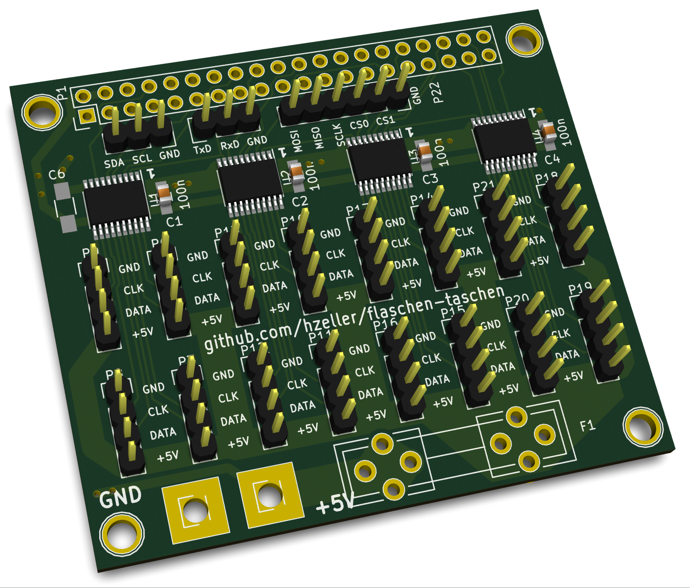

Noisebridge Flaschen Taschen Project
====================================


Software for [FlaschenTaschen].

FlaschenTaschn is inspired by [MateLight]: a bunch of us have
seen Mate Light in action at [32c3] and got excited :)
So our Noisebridge interpretation of it has a German influenced name.

Unfortunately, in the US, bottle reuse is not at all a thing, so there
are no standardized crates with bottles you can buy.
So we use milk crates (which is a thing) and put common, clear 12oz (355ml)
bottles in (Mate, Corona,..) inside. Wrapped in aluminum foil, they
make nice pixels.

Right now, we're playing with multiple different types of strips to settle
before a larger order.

Current hardware setup:

   1. column: LDP6803  (<- 5 bit grayscale, meh).
   2. column: WS2811   (<- nasty timing sensitive single line serial)
   3. column and 4. column: WS2801  (<- most likely the type to settle on)


See little video in the [ExperimentalStage] blog post. Ideally, we'd like to
have APA102, but they don't seem to be available wired up in the way we'd need
for the bottles.

Final set-up will be 9 crates wide and 7 crates high for a total of 63 crates
with 25 'pixels' each. 45x35 pixels or 1575 pixels total. All operated by
a Raspberry Pi that provides a network API to update the display.

## Tutorial: getting started

To develop visuals for the FlaschenTaschen display once it is ready, here you
already can play around writing software that updates the networked display.

#### 1. Check out the project

```bash
$ git clone --recursive https://github.com/hzeller/flaschen-taschen.git
$ cd flaschen-taschen
```

Make sure to use the `--recursive` flag, as there are sub-modules to check
out. If you forgot that, type

```
$ git submodule update --init
```

in the `flaschen-taschen/` directory.

#### 2. Compile and run local server
In one terminal, go to the [server/](./server) directory, compile the
terminal-based display and run it. Make sure to have it large enough to show
all pixels:

```
$ cd server
$ make FT_BACKEND=terminal
$ ./ft-server   #  this will now show a black 'screen'
```

If you want to dig into details and understand the various server
implementations, check out the [server README](./server/README.md).

#### 3. Run client programs
In another terminal, go to the [client/](./client) directory, compile
the programs and run it.

```
$ cd client
$ make simple-animation
$ ./simple-animation localhost # <- network address of output
```

Easiest to get started with the programming is
to read the [simple-example.cc](./client/simple-example.cc) code, then move on
to [simple-animation.cc](./client/simple-animation.cc).

If you want to implement the simple network protocol in another language
[check out the protocol description](./doc/protocols.md) or look at the
[C++ implementation](./client/udp-flaschen-taschen.cc)

For some immediate fun, compile send-image (`make send-image`, see
[SendImage section in client/](./client/README.md#sendimage) for needed
dependencies), then run
`./send-image -h localhost some-image.png` which reads images and
sends them to the FlaschenTaschen display (also animated gifs):

<a href="server/#terminal"></a>

## Connecting LED strips to the Pi

Right now, LED strips are wired up with some ad-hoc level shifter
(re-using a [RGB Matrix Adapter] board). In the near future, this will be
replaced by something [dedicated for the task](./hardware):

<a href="hardware/"></a>

[FlaschenTaschen]: https://noisebridge.net/wiki/Flaschen_Taschen
[MateLight]: https://github.com/jaseg/matelight
[ExperimentalStage]: http://blog.noisebridge.net/post/139304835544/i-walked-into-noisebridge-yesterday-and-was
[RGB Matrix Adapter]: https://github.com/hzeller/rpi-rgb-led-matrix/tree/master/adapter/active-3
[32c3]: https://events.ccc.de/congress/2015/wiki/Static:Main_Page
