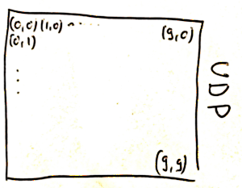
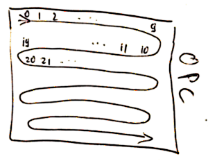
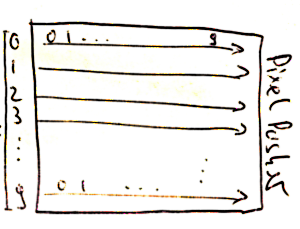

Noisebridge Flaschen Taschen Project
====================================


Software for [FlaschenTaschen].

FlaschenTaschn is Inspired by [MateLight]: a bunch of us have
seen Mate Light in action at 32c3 and got excited :)
So our Noisebridge interpretation of it has a German inspired name.
Unfortunately, in the US, bottle reuse is not at
all a thing, so there are no standardized crates with bottles you can buy.
So we use milk crates (which is a thing) and put common, clear bottles in
12oz (355ml) (Mate, Corona,..) inside. Wrapped in aluminum foil, they
make nice pixels.

Right now, we're playing with multiple different types of strips to settle
before a larger order.

Current hardware setup:

   1. column: LDP6803  (<- 5 bit grayscale, meh).
   2. column: WS2811   (<- nasty timing sensitive single line serial)
   3. column and 4. column: WS2801  (<- most likely the type to settle on)

See little video in the [ExperimentalStage] blog post. Ideally, we'd like to
have APA102, but they don't seem to be available wired up in the way we'd need
for the bottles.

Final set-up will be 9 crates wide and 7 crates high for a total of 63 crates
with 25 'pixels' each. 45x35 pixels or 1575 pixels total. All operated by
a Raspberry Pi that provides a network API to update the display.

## Operating Instructions

The Flaschen-Taschen server `ft-server` becomes a daemon (also it drops
privileges to daemon:daemon). Kill the hard way with `sudo killall ft-server`

## Getting Pixels on Flaschen Taschen

To make it simple to illuminate the matrix, there are _three_ protocols that
are all supported:

 * Receives UDP packet on port 1337 interpreted as framebuffer (RGBRGB...)
   (Simulated layout standard left-right, top-bottom framebuffer expected). Easy
   way to get such raw picture is to edit out the header out of *.ppm file.
   (this protocol is likely to change to include size essentially directly
   accepting a `P6` PPM file. This makes things more flexible and easier
   to send. And we can extend it for offset. But for now: just a raw image).
    


 * Runs http://openpixelcontrol.org/ server on standard port 7890
   (Simulated layout row 0: left-right, row 1: right-left, row 2: left-right...;
   this is what their standard `wall.py` script assumes).



 * Provides pixel pusher control via standard beacon (this is cool to be used
   together with processing, there are libs that support it).
   (Simulated layout: 10 strips starting on the left with 10 pixels each;
   pretty much like a standard framebuffer).



Within noisebridge, the hostname is `flaschen-taschen.local`.

So, for instance you can send a raw image to the service like this; each pixel
represented by a red/green/blue byte.

```
cat raw-image.bytes | socat STDIO UDP-SENDTO:flaschen-taschen.local:1337
```

Or, if you are using bash, it is even simpler
```
cat raw-image.bytes > /dev/udp/flaschen-taschen.local/1337
```

The current display is 10x10 pixels, so it would be 3 * 100 bytes.

You find more in the [client/ directory](./client) to directly send
content to the server.

## Build Instructions

Note: This project uses a git submodule for controlling ws28xx from the Raspberry Pi software by [jgarf](https://github.com/jgarff/rpi_ws281x)

```bash
$ git clone --recursive https://github.com/hzeller/flaschen-taschen.git
$ cd flaschen-taschen
$ make -C server
$ sudo ./server/ft-server   # runs as daemon on a Raspberry Pi.
# Clients to send content to the display can be found in the client/ dir
$ sudo aptitude install libmagick++-dev
$ make -C client
```

If you are reading this after cloning and forget to clone recursively, you can just run the following git command to update the submodule:

```
$ git submodule update --init
```

[FlaschenTaschen]: https://noisebridge.net/wiki/Flaschen_Taschen
[MateLight]: https://github.com/jaseg/matelight
[ExperimentalStage]: http://blog.noisebridge.net/post/139304835544/i-walked-into-noisebridge-yesterday-and-was
