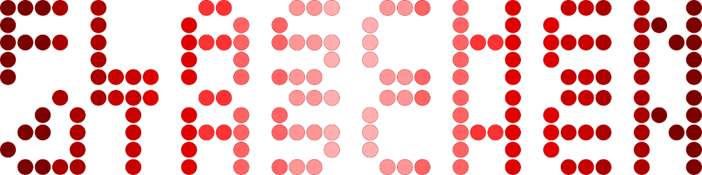
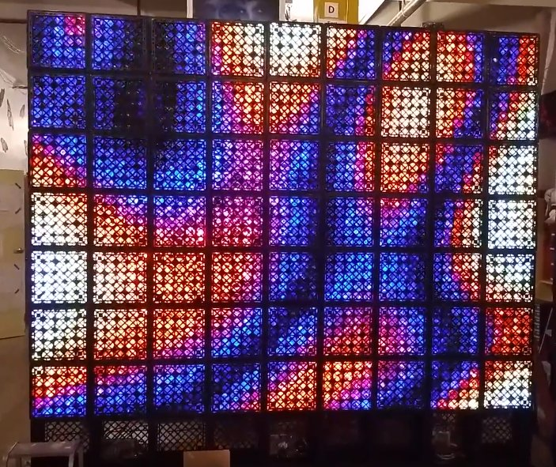
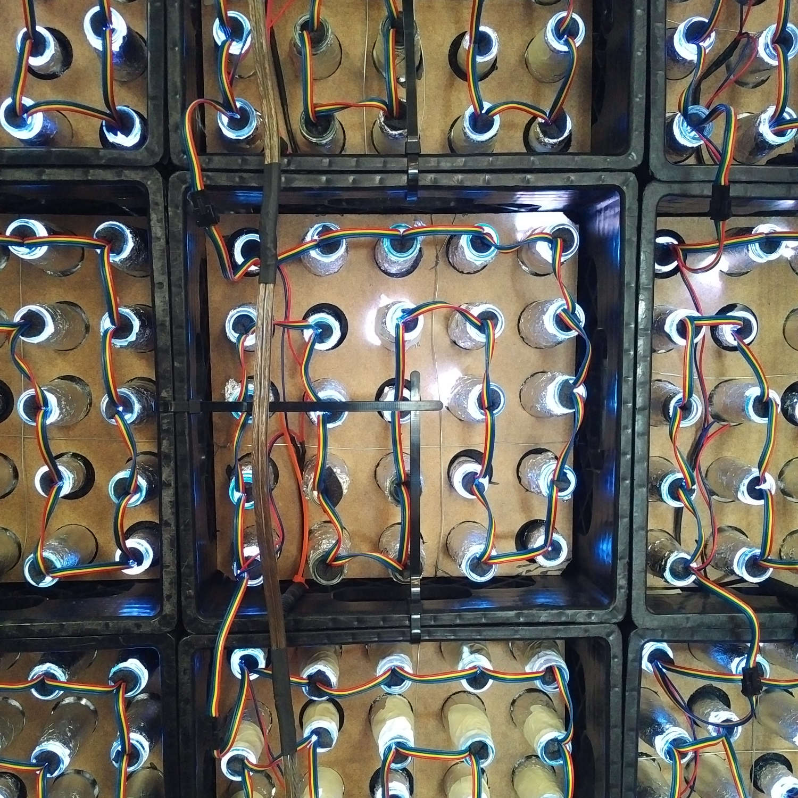

Noisebridge Flaschen Taschen Project
====================================


<a href="https://noisebridge.net/wiki/Flaschen_Taschen"></a>

Software and Raspberry Pi interface hardware for [FlaschenTaschen].

FlaschenTaschen is inspired by projects such as the [Muro de botellas]
or [MateLight]. A bunch of Noisebridgers have seen Mate Light in action
at [32c3] and got excited :)
So our Noisebridge interpretation of it has a German influenced name.

Unfortunately, in the US, bottle reuse is not at all a thing, so there
are no standardized crates with bottles you can buy.
So we use milk crates (which is a thing) and put common, clear 12oz (355ml)
bottles in (Mate, Corona,..) inside. Wrapped in aluminum foil, they
make nice pixels.



How about [Star Wars](https://youtu.be/OEUFIpM10FE) on the completed
display ?

The set-up is 9 crates wide and 7 crates high for a total of
63 [crates (see wiring here)](./doc/wiring.md) with 25 'pixels' each
(this is what fits in our MakerFaire booth). 45x35 pixels or 1575 pixels total.
All operated by a Raspberry Pi that provides a [network API][protocols] to
update the display.

This is how it looks from the back:

<a href="doc/wiring.md"></a>

## Tutorial: getting started

To develop visuals for the FlaschenTaschen display once it is ready, here you
can already play around writing software that updates the networked display.
(If you're running a Mac, switch to `mac-os-compilable` branch as it has some
Linux specifics removed).

#### 1. Check out the project

```bash
$ git clone --recursive https://github.com/hzeller/flaschen-taschen.git
$ cd flaschen-taschen
```

#### 2. Compile and run local server showing content in a Terminal

If you are not around Noisebridge to directly send images to the FlaschenTaschen
installation, then you can start your own FlaschenTaschen server that displays
the pixels as colored spaces in a terminal. Note, you need a fairly recent
terminal that can display 24 Bit color (Konsole can do that for a while, more
recent Gnome terminals as well. Also, newer xterms can do that as well. If you
are on a Mac, an iTerm2 version 3.x will work).

<a href="server/#terminal"></a>


In one terminal, go to the [server/](./server) directory, compile the
terminal-based display and run it. Make sure to have it large enough to show
all pixels:

```
$ cd server
$ make FT_BACKEND=terminal
$ ./ft-server   #  this will now show a black 'screen'
```

(looks too big on screen ? Try adding the option `--hd-terminal`)

If you want to dig into details and understand the various server
implementations, check out the [server README](./server/README.md).

#### 3. Run client programs
In another terminal, go to the [client/](./client) directory, compile
the programs and run it.

```
$ cd client
$ make simple-animation
$ ./simple-animation localhost # <- network address of display.
```

Easiest to get started with the programming is
to read the [simple-example.cc](./client/simple-example.cc) code, then move on
to [simple-animation.cc](./client/simple-animation.cc).

If you want to implement the simple network protocol in another language
[check out the protocol description](./doc/protocols.md) or look at the
[C++ implementation](./client/udp-flaschen-taschen.cc)

For some immediate fun, send a PPM image to your server. Since the server
already understands that format natively, you can unleash the usual
[netpbm] toolbox for image manipulation:

```
bash$ jpegtopnm myimage.jpg | pnmscale -xysize 45 35 > /dev/udp/localhost/1337
```

For a tool that decodes images (including animated gifs), compile `send-image`
(`make send-image`, see
[Send-Image section in client/](./client/README.md#send-image) for needed
dependencies), then run
`./send-image -h localhost some-image.png` which reads images and
sends them to the FlaschenTaschen display.

## Related Software

There are various projects that create demos for F~T. Collecting links here.
Check out these repositories:

  * https://github.com/cgorringe/ft-demos Demos such as [plasma](./img/ft-completed.jpg), lines, quilt, ...
  * https://github.com/scottyallen/flaschenvnc VNC implementation:
   cast your screen to FlaschenTaschen
   ([like so](https://www.youtube.com/watch?v=s3pGp_Vf4Pk))
  * A [FlaschenTaschen VLC output](https://git.videolan.org/?p=vlc.git;a=commit;h=cf334f257868d20b6a6ce024994e84ba3e3448c3) by François Revol.
    It is already submitted upstream, but until it hits distributions, you have
    to [compile VLC from git](https://wiki.videolan.org/UnixCompile/).
    Then run it like so:

   ```
    $ vlc --vout flaschen --flaschen-display=ft.noise \
          --flaschen-width=45 --flaschen-height=35 \
          <video-filename-or-YouTube-URL>
   ```

## Connecting LED strips to the Pi

LED strips are controlled by a Raspberry Pi, connected via
a [custom level shifter][spixels-hardware] (provided in the separate
[spixels] library) for up to 16 strips (of which we only use 9 for our
installation right now):

<a href="https://github.com/hzeller/spixels/tree/master/hardware"></a>

[FlaschenTaschen]: https://noisebridge.net/wiki/Flaschen_Taschen
[Muro de botellas]: http://www.zuloark.com/muro-de-botellas/
[MateLight]: https://github.com/jaseg/matelight
[RGB Matrix Adapter]: https://github.com/hzeller/rpi-rgb-led-matrix/tree/master/adapter/active-3
[32c3]: https://events.ccc.de/congress/2015/wiki/Static:Main_Page
[protocols]: ./doc/protocols.md
[netpbm]: http://netpbm.sourceforge.net/
[2025-video]: https://www.youtube.com/watch?v=hs8FoROzE4M
[7of9-video]: https://www.youtube.com/watch?v=Uc2-8ntcEpY
[spixels-hardware]: https://github.com/hzeller/spixels/tree/master/hardware
[spixels]: http://spixels.org/
