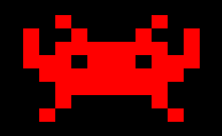

Flaschen Taschen Clients
========================

Programs to send content to the FlaschenTaschen server. The server implements
multiple protocols so that it is easy to use various means to connect to
FlaschenTaschen; see toplevel
directory [README.md](../README.md#getting-pixels-on-flaschen-taschen).

This directory provides:
  * `send-image` binary, that reads an arbitrary image (including
    animated *.gifs), scales it and sends to FlaschenTaschen.
  * A simple-example.cc code example.
  * (more TBD. Pull requests encouraged, hint hint...)

## SendImage

### Compile
```bash
# Need some devel libs
sudo aptitude install libgraphicsmagick++-dev libwebp-dev
make send-image
```

### Use
```
usage: ./send-image [options] <image>
Options:
        -g <width>x<height>[+<off_x>+<off_y>] : Output geometry. Default 20x20+0+0
        -h <host>                             : host (default: flaschen-taschen.local)
        -s                                    : scroll horizontally.
```

Essentially just send the FlaschenTaschen display an image over the network:

```
./send-image -g10x20+15+7 some-image.png
```

Image will be scaled to the given size (here 10x20) and shown
on the FlaschenTaschen display at the given offset (here 15 pixels x-offset,
7 pixels y-offset).

The program exits as soon as the image is sent unless it is an animated gif in
which case `send-image` keeps streaming until interrupted with `Ctrl-C`.

If you want to scroll a long image accross the display, use the `-s` option. In
this case, only the height is scaled to the display height and the image is
scrolled infinitely over width.

Let's try this with an example image:

```
./send-image -s ../img/flaschen-taschen-black.ppm
```

## Example Code

Coding content for FlaschenTaschen is trivial as you just need to send it UDP
packets with the content. Any language of your choice that supports networking
will do.

For C++, there is a simple implementation of such a 'client display', the
[simple-example.cc](./simple-example.cc) helps to get started.

```c++
#include "udp-flaschen-taschen.h"

#define DISPLAY_WIDTH  20
#define DISPLAY_HEIGHT 20

int main() {
    // Open socket and create our canvas.
    const int socket = OpenFlaschenTaschenSocket("flaschen-taschen.local");
    UDPFlaschenTaschen canvas(socket, DISPLAY_WIDTH, DISPLAY_HEIGHT);

    const Color red(255, 0, 0);
    canvas.SetPixel(0, 0, red);              // Sample with color variable.
    canvas.SetPixel(5, 5, Color(0, 0, 255)); // or just use inline (here: blue).

    canvas.Send();                           // Send the framebuffer.
}
```

Next step, try a [simple-animation.cc](./simple-animation.cc)
<a href="./simple-animation.cc"></a>
