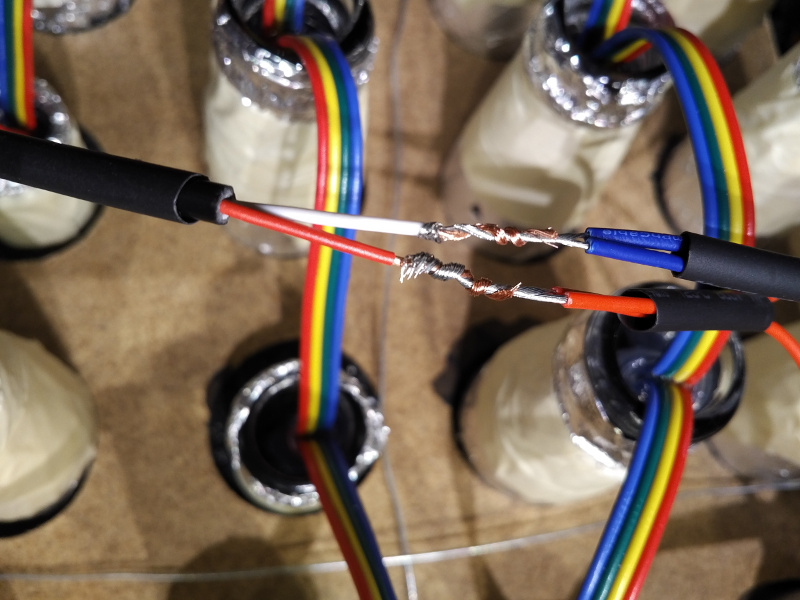
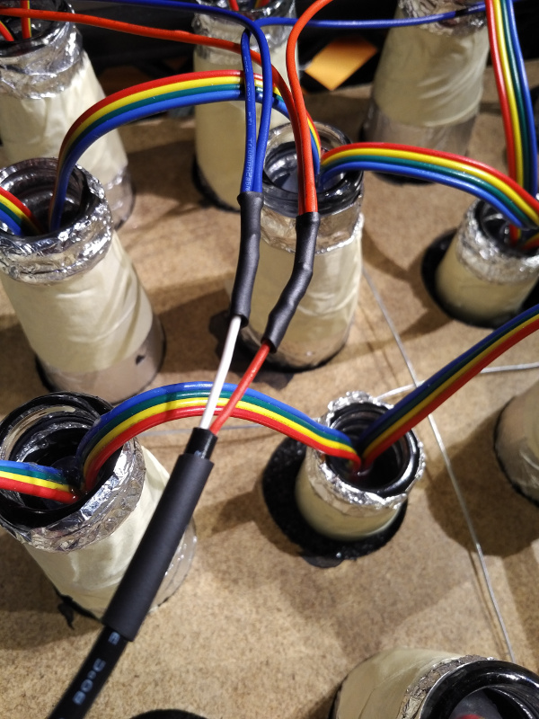
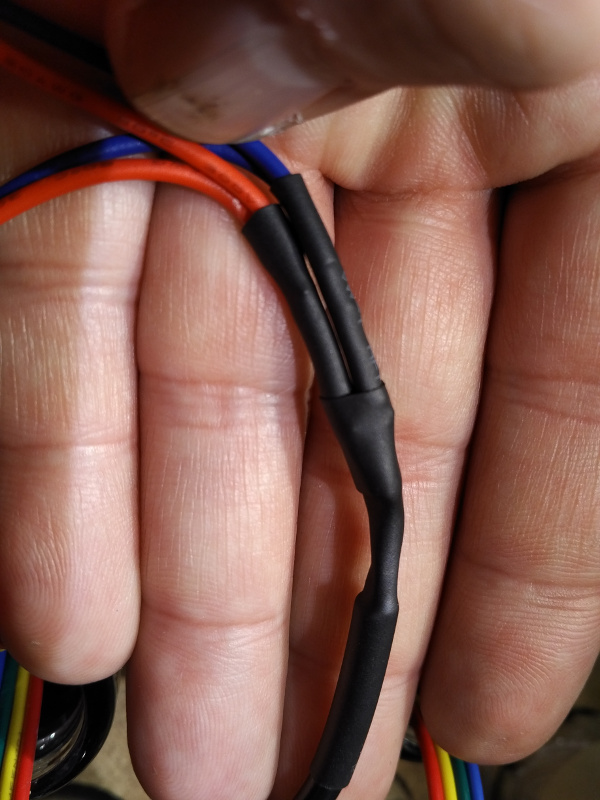
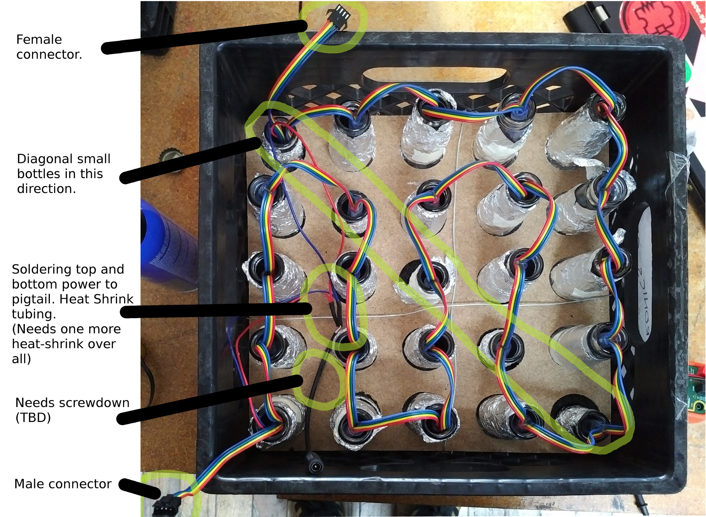

Wiring the crate
================

Looking from the back, the crate has the incoming data on the left bottom,
exit top left. We also have one power barrel connector on each crate, as well on the bottom
left.

The wiring is in a zig-zag pattern through the crate such that we reach the goal having
the incoming/outgoing cables at the right place.

## Tracing through the Crate

Here some schematic representation - Stars represent the bottle-necks, the arrows
the wiring between them. You can retrace that in the picture below.

```
  |  outgoing. 4-position female connector.
+-|---------------------+
| * <- * <- * <- * <- * |
|                     ^ |
| * -> *    * -> *    * |
| ^    v    ^    v    ^ |
| *    *    *    *    * |
| ^    v    ^    v    ^ |
| *    *    *    *    * |
| ^    v    ^    v    ^ |
| *    * -> *    * -> * |
+-|---------------------+
  |
  | Incoming. 4 position male connector.
```


## The power connection

The LED power inputs are long loose cables on both ends of the strip that we
combine and solder to a barrel-jack receptacle pig-tail, see image below.
Make sure to thread the wires from the LED _under_ the data wiring between the bottles.

As a preparation for soldering, the pigtail needs to be shortened about 10cm (4 inches),
the LED power cables roughly 6cm (2.5 inches) to not have too much slack. When removing outer
insulation from the pig-tail, make sure to not injure the insulation of the inner cables.

Uninsulate about 1 inch of the wires going to the LEDs and twist together the red
and blue ones separately. Put a ~1 inch of heat-shrink tubing up each pair now, so that we don't
forget that - move it up enough that it won't heat up while we solder.

Put about 1.5 inches of heat-shrink tubing wide enough to fit around the pigtail insulation now
as well - we need that later to tie everything together.

Now, uninsulate as well the wires on the pigtail about 1 inch. Now make a
[Lineman splice] with the corresponding wire-pair from the
LEDs (colors: red with red, white (pigtail) with blue (LED)). Solder the splice (it giving the
twisting, the whole length of the splice is now probably about 1/2 inch).

(If anything: remember the [Lineman splice] - it is a very useful skill!).

Move the heat-shrink that we have parked on the LED cables to each connection and shrink with
quick movements with a lighter (or, if that is not at hand, with the hot-air gun).

  Splice before solder.  |  Heat Shrunk.           | Heat Shrink overall.      | Done.
-------------------------|-------------------------|---------------------------|--------------------------|
||||


Let it cool so that it is hand-warm again. Then move the heat-shrink parked on the pigtail
up so that it squeezes the other heat-shrunk connection together and on the other end covers the
outer insulation of the pigtail. Shrink that. Now we have a sturdy connection.

(Use the heat shrink of which we have large rolls in the electronic area on the
left side on the shelf).

The Pigtail should be cable-tied to the crate for now. Later on we might want
a stress relief flap screwed to the wood ?



[Lineman splice]: http://makezine.com/2012/02/28/how-to-splice-wire-to-nasa-standards/
