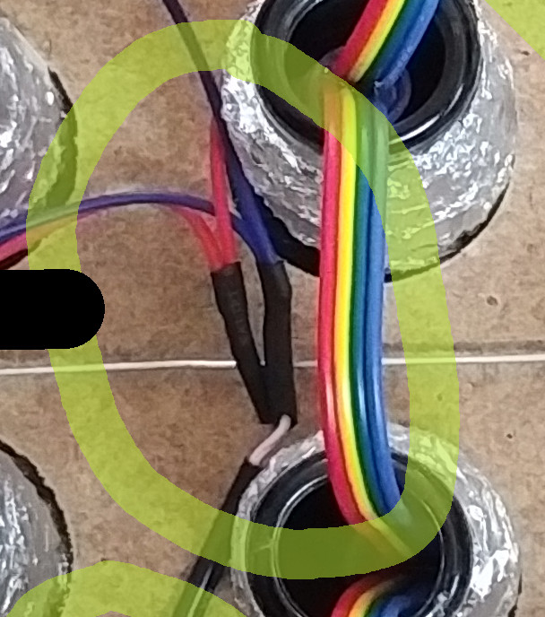

Wiring the crate
================

Looking from the back, the crate has the incoming data on the left bottom,
exit top left.

The wiring is in a zig-zag pattern

This symbolizes the connections. Stars represent the bottle-necks, the arrows
the wiring between them.

```
  |  outgoing. 4-position female connector.
+-|---------------------+
| * <- * <- * <- * <- * |
|                     ^ |
| * -> *    * -> *    * |
| ^    v    ^    v    ^ |
| *    *    *    *    * |
| ^    v    ^    v    ^ |
| *    *    *    *    * |
| ^    v    ^    v    ^ |
| *    * -> *    * -> * |
+-|---------------------+
  |
  | Incoming. 4 position male connector.
```

The power connections are long cables on both ends of the strip that are
combined and soldered to a pig-tail, see image below. Make sure to thread the
power wired _under_ the other wiring, so that it is not flapping in the wind.

The pigtail needs to be shortened about 10cm (4 inches), the LED power cables
roughly 6cm (2.5 inches). Make a solder joint (red on red, blue on white) with
one shrink-tubing each (see intermediate state here:)



Then a heat-shrink around the whole connection (not pictured). Remember to put
the heat shrink on the pig-tail cable _first_ before soldering :)
(Use the heat shrink of which we have large rolls in the elecronic area on the
left side).

The Pigtail should be cable-tied to the crate for now. Later on we might want
a stress relief flap screwed to the wood ?


