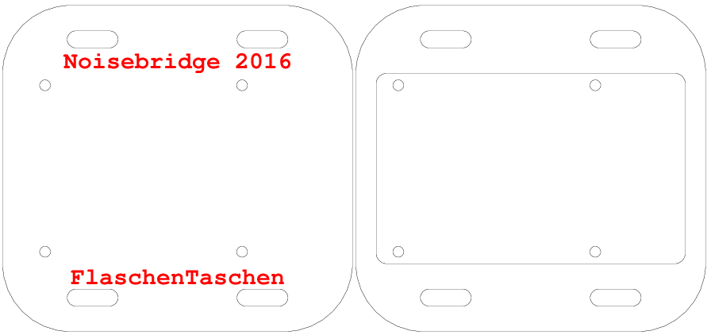

Hardware
========

## Connecting LED strips to the Pi

LED strips are controlled by a Raspberry Pi, connected via
a custom level shifter that first has been developed for FlaschenTaschen
but is now broken out as [separate Spixels PCB and library][spixels].

This adapter to the Raspberry Pi can support up to 16 SPI LED strips
(of which we only use 9 for our installation right now):

## Mounting Plate

To mount the Pi to the crates with zip-ties there is a laser-cut rig.
[Source](./pi-mounting-rig.ps)
is written in PostScript, that can be converted to the
[DXF file](./pi-mounting-rig.dxf) with the Makefile.

[spixels-hardware]: https://github.com/hzeller/spixels/tree/master/hardware
[spixels]: http://spixels.org/
