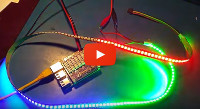

Hardware
========

## Connecting LED strips to the Pi

LED strips are controlled by a Raspberry Pi, connected via
a custom level shifter that first has been developed for FlaschenTaschen
but is now broken out as [separate Spixels PCB and library][spixels].

This adapter to the Raspberry Pi can support up to 16 SPI LED strips (e.g. WS2801 or APA102) at once.

&nbsp;&nbsp;&nbsp;&nbsp;&nbsp;

## Pi Mounting Plate

We have the Pi in a separate crate together with one of the power supplies. It is
held in place with zip-ties through the holes of the crate using this
laser-cut mounting plate. To be easily modifyable,
[it is written in PostScript](./pi-mounting-rig.ps) and can be converted to a
[DXF file](./pi-mounting-rig.dxf) (a typical input to laser cutters)
with the Makefile.

[spixels-hardware]: https://github.com/hzeller/spixels/tree/master/hardware
[spixels]: http://spixels.org/
