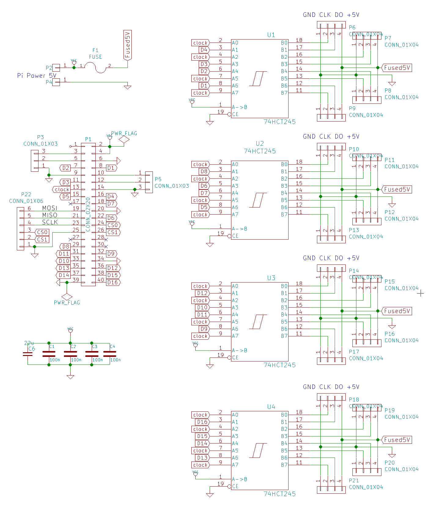

16 LED strip Raspberry Pi Adapter
=================================

Adapter to connect up to 16 SPI-type LED strips (e.g. WS2801 or LDP6803). The output pins
contain GND, CLK and Data. Also, 5V is given which can be useful for active termination of
longer wires.

Pinout of each of the connectors:

GND | CLK | DATA | +5V
---:|:---:|:----:|:---

(GND is pointing towards the Rasbperry Pi GPIO header).

### Features

* 16 data outputs for LED strips including GND and 5V. All outputs receive data in parallel.
* Input power (5V) operates level shifter as well as the Raspberry Pi; no separate USB supply
  needed.
* Fused 5V outputs on connectors to prevent accidents.
* Breakout for I2C, UART and SPI busses of Raspberry Pi to allow connecting other peripherals.

The CLK is shared, but each connector gets a dedicated buffered signal.

The 5V output, accessible on each of the 16 connectors, is fused, so that accidental shorts when
messing with the LED strip wires in the field do not cause harm. Use a fast 1A fuse.

(The outputs are beefy enough that they even could support a couple of shorter
5V LED strips directly, in that case use up to 20A fuse. Generally it is
advised to separately power the strips though: 20A only powers 300 LEDs
or so.)

### BOM
Count | Type                        | Package     | Info
-----:|-----------------------------|-------------|------------
    4 | 74HCT245                    | TSSOP-20
    4 | 100nF ceramic capacitor     | 0805
    1 | 22µF ceramic capacitor, 6.3V| 1206
    1 | 20x2 female pin socket      | 0.1" raster  | to connect to Pi GPIO
   16 | 4x1 male pin header         | 0.1" raster  | to connect to LED strips
    1 | Fuse holder                 | for 20mm fuse| Optional (see text)

[ As soon as design is tested in the field, there will be an OshPark link here ]

