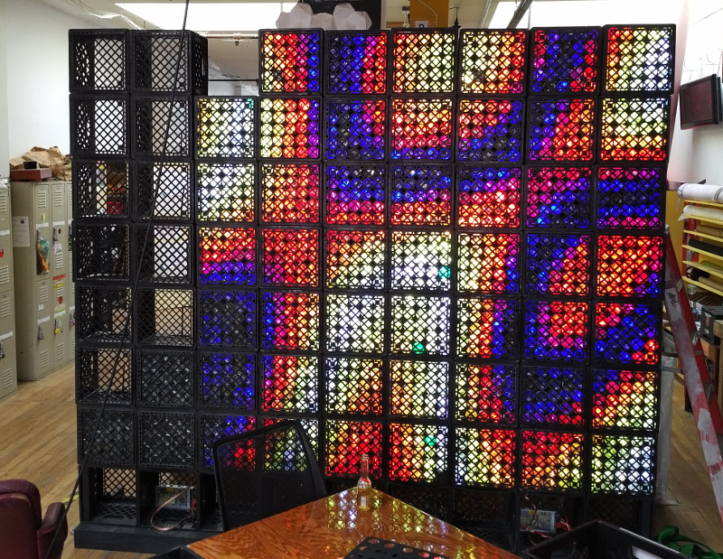
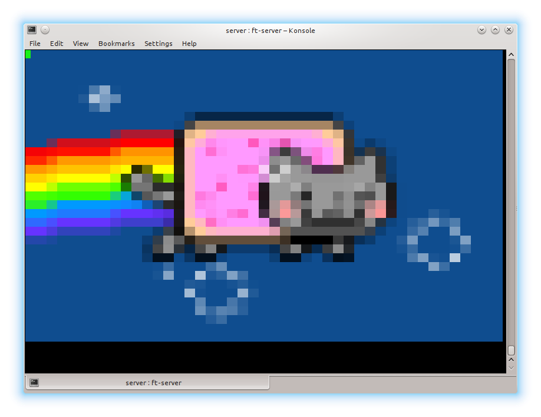
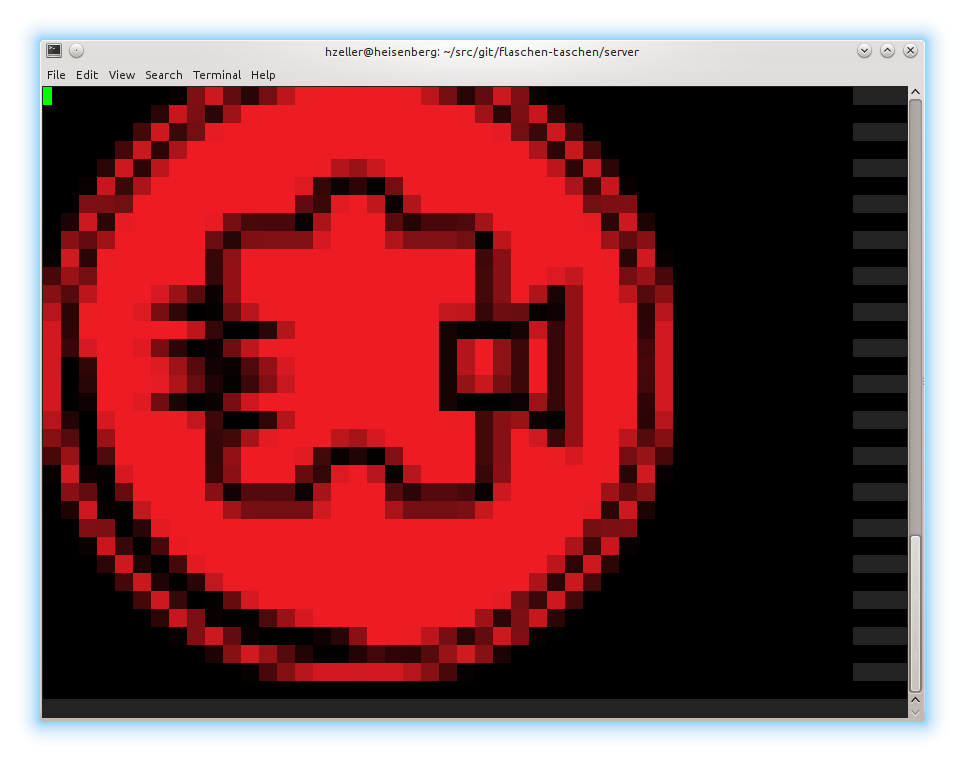

Server implementation
=====================

The server implements various [protocols](../doc/protocols.md) so that
it is easy to interface with the display over the network.

## Regular Flaschen Taschen server

For the actual Flaschen Taschen display, simply build with

```
  make
```

These are the options

```
usage: ./ft-server [options]
Options:
	-D <width>x<height> : Output dimension. Default 45x35
	-I <interface>      : Which network interface to wait for
	                      to be ready (e.g. eth0. Empty string '' for no waiting).
	                      Default ''
	-d                  : Become daemon
	--pixel-pusher      : Run PixelPusher protocol (default: false)
	--opc               : Run OpenPixelControl protocol (default: false)
(By default, only the FlaschenTaschen UDP protocol is enabled)
```

```bash
 # Run as root.
 sudo ./ft-server -d --opc --pixel-pusher
```

The server has to be started as root as it has to access and initialize the
GPIO pins, but it drops privileges to uid=daemon, gid=daemon after that is done.

Stopping ? Kill the hard way `sudo killall ft-server`.

*This assumes to be running on the Raspberry Pi* as it needs to access the
[GPIO pins](../hardware) to talk to the LED strips.

Currently, the actual display is still work in progress:



## Testing setups

While the actual FlaschenTaschen display is still work in progress (until
we have all the bottles, crates and LEDs), we already want to prepare
applications that use the display, so need a test server implementation to
get an impression of the final looks.

For this, we have test-setups, that allow to simulate the display in
its full final resolution supporting the same protocol.

### Terminal

On any development machine with a somewhat decent terminal that allows for
24Bit [ANSI color][term-color] (konsole, xterm or
gnome-terminal), this `ft-server` allows to display the result in a
terminal.

```bash
  # Build with
  make FT_BACKEND=terminal
```

```bash
  # Then run (and optionally pass the desired resolution)
  ./ft-server -D45x35
```





### RGB Display

If you have an [RGB matrix][rgb-matrix] connected to a Pi, you can run that
as Flaschen Taschen backend:

```bash
  make FT_BACKEND=rgb-matrix
```

```bash
  # Then run with
  sudo ./ft-server -D45x35
```

This runs on a Raspberry Pi; see the
[documentation in the RGB-Matrix project][rgb-matrix]

[rgb-matrix]: https://github.com/hzeller/rpi-rgb-led-matrix
[term-color]: https://gist.github.com/XVilka/8346728
