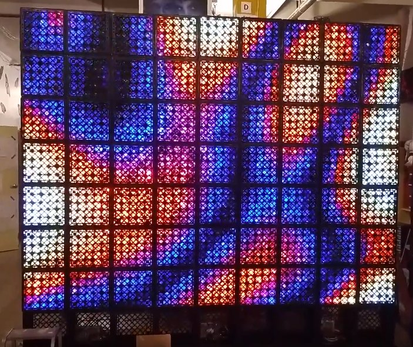

Server implementation
=====================

The server implements the [network protocol](../doc/protocols.md) so that
it is easy to interface with the display over the network.

## Regular Flaschen Taschen server

For the actual Flaschen Taschen display, simply build with

```
  make FT_BACKEND=ft
```

(Note, this needs the http://spixels.org library, which is included as git
sub-module. So you have to `git clone --recursive` the flaschen-taschen repo).

These are the options

```
usage: ./ft-server [options]
Options:
        -D <width>x<height> : Output dimension. Default 45x35
        --layer-timeout <sec>: Layer timeout: clearing after non-activity (Default: 15)
        -d                  : Become daemon
```

```bash
 # Run as root.
 sudo ./ft-server -d
```

To change resolution and composition of the actual display, you have to
manually adapt the code in main.cc (look for `display.AddColumn()`) - to
choose type of LED strip and to which SPI port on the spixels hardware they
are connected to.

The server has to be started as root as it has to access and initialize the
GPIO pins, but it drops privileges to uid=daemon, gid=daemon after that is done.

Stopping ? Kill the hard way `sudo killall ft-server`.

*This assumes to be running on the Raspberry Pi* as it needs to access the
[GPIO pins](../hardware) to talk to the LED strips.



## Testing setups

If you are not at Noisebridge right now but want to hack on applications
that use the display, you can use different ways to visualize the output with
the following applications.

These test-setups allow to simulate the display in its full resolution
supporting the same protocol.

### Terminal

On any development machine with a somewhat decent terminal that allows for
24Bit [ANSI color][term-color] (konsole, xterm or gnome-terminal on Linux;
xterm/X11 or iTerm2 >= 3.0 on OS X), this `ft-server` allows to display the
result in a terminal.

```bash
  # Build with
  make FT_BACKEND=terminal
```

```bash
  # Then run (and optionally pass the desired resolution)
  ./ft-server -D45x35
```

This also has an option to have a more compact representation - the resolution
is twice as high which allows to display it on smaller terminals. However,
it depends a bit more on your terminal to properly display UTF-8 characters:

```bash
./ft-server -D45x35 --hd-terminal
```

Regular terminal             | With `--hd-terminal` Option   |
-----------------------------|-------------------------------|
  |    |


### RGB Matrix Panel Display

If you have an [RGB matrix][rgb-matrix] connected to a Pi, you can run that
as Flaschen Taschen backend:

```bash
  make FT_BACKEND=rgb-matrix
```

Run it and pass the usual [rpi-rgb-led-matrix flags][led-flags]. Here, we have
a set-up with three parallel chains of 5 32x32 displays each
```bash
  sudo ./ft-server --led-chain=5 --led-parallel=3 --led-rows=32
```

If you pass the option `-d`, it will run as daemon in the background.

[![RGB-MatrixImpl][ft-rgb-vid]](https://www.youtube.com/watch?v=XeJBcNevuJE)
(this is 160x96 display with the `--led-chain=5 --led-parallel=3`).

This runs on a Raspberry Pi; see the
[documentation in the RGB-Matrix project][rgb-matrix]

[rgb-matrix]: https://github.com/hzeller/rpi-rgb-led-matrix
[ft-rgb-vid]: ../img/rgb-matrix-sample-vid.jpg
[term-color]: https://gist.github.com/XVilka/8346728
[led-flags]: https://github.com/hzeller/rpi-rgb-led-matrix#changing-parameters-via-command-line-flags